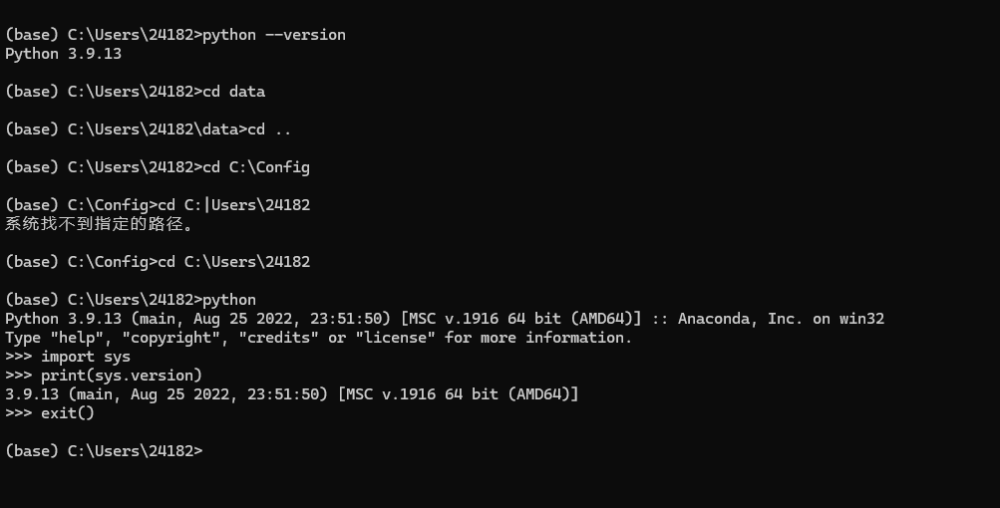
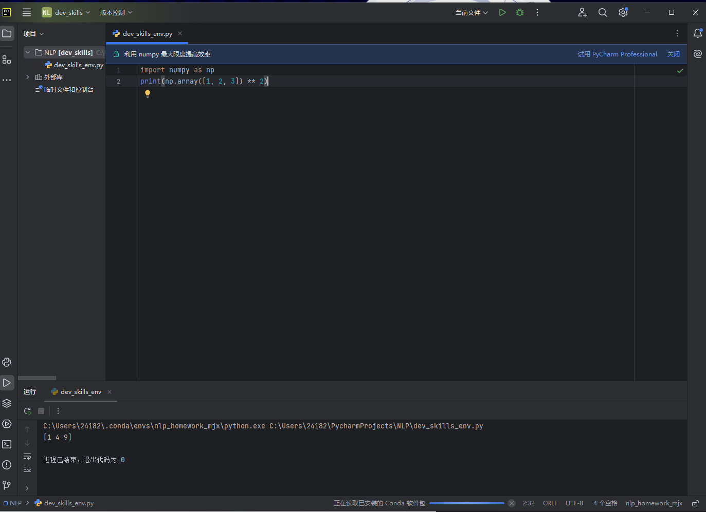

# 喜羊羊的自我介绍


大家好，我是**喜羊羊**，我的身份是*青青草原上的一只羊*。以下是我的自我介绍：

---

## 基础档案 

### 外貌特征 
- 脖子戴着一个蓝色的铃铛
- 头上有一撮向下卷的羊毛

### 我的朋友
1. 美羊羊
2. 懒羊羊
3. 沸羊羊
4. 暖羊羊
5. ~~灰太狼~~

### 重要坐标
- 🏠 **住址**: [青青草原](https://baike.baidu.com/item/%E9%9D%92%E9%9D%92%E8%8D%89%E5%8E%9F/18834) 
- 🏢 **具体地点**: [羊村](https://baike.baidu.com/item/%E7%BE%8A%E6%9D%91/70871)

### 角色生活
> 居住在青青草原的羊村里，在大肥羊学校上学，食物以青草为主，喜爱各种美食，有时也会用道具或武器。当同伴有困难时积极帮助。在想办法时喜欢一手托着下巴一手指太阳穴，然后跳起来原地转三圈。曾多次运用智慧保护羊村，是羊村的小英雄。

### 性格特点
> 顽皮淘气，机智可爱，意志坚强，信守承诺，抵制诱惑，且有勇有谋，总是临危不乱。
---

## 我的专业是人工智能无人系统
### 我最喜欢的一段代码

```python
import numpy as np
print(np.array([1, 2, 3]) ** 2)
```
其中执行`print(np.array([1, 2, 3]) ** 2)`可输出结果。

### 我最喜欢的环境管理工具是conda

### 我可以在IDE上使用我建立的虚拟环境
